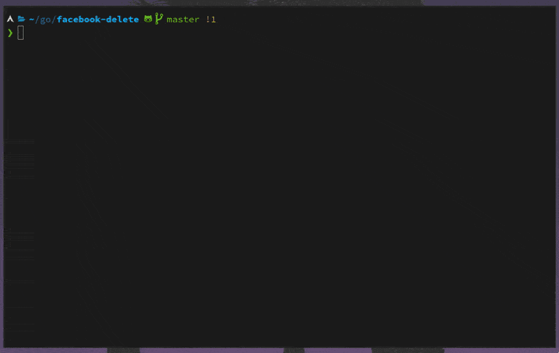

# Fast Facebook Activity Deletion

This program can be used to clean up a facebook account without deleting the entire account.

_Note: Facebook has a very strange login process. Please open a GitHub issue if the program is not able to login. Here's a [workaround for the login process](https://github.com/marcelja/facebook-delete/wiki/Login-with-browser-cookie) which you can also use if your account has two-factor authentication enabled._



## Run program

Binaries for Linux, macOS and Windows are attached to a release.

### Download binary

Download the binary file for your platform of the [latest release](https://github.com/marcelja/facebook-delete/releases).

Linux/macOS: Make the binary executable and run it. Example:

```
$ chmod +x deleter-linux
$ ./deleter-linux
```

Windows: Run the .exe file and select "More information" and "Run anyway".

### From source

A recent [Go](https://golang.org/) version needs to be installed. This can be done via your package manager or the golang website.

__Clone this repository__

```
$ git clone https://github.com/marcelja/facebook-delete.git
$ cd facebook-delete
$ go install
$ go run deleter.go
```

## Cookies

Cookies are saved to `$HOME/.go-cookies` if the `$GOCOOKIES` variable is not set (see https://github.com/juju/persistent-cookiejar).

## Options

### Rate-limiting

Facebook will temp-block you if you make too many requests too quickly. Run the command with the `-rateLimit <time in ms>` to introduce a delay before each request. If you're getting hung up on just searches or deletes, you can disable rate-limiting for one or the other with `-limitSearch=0` or `-limitDelete=0`.

E.g. one of:

```
$ ./deleter-linux -rateLimit 500
$ ./deleter-linux -rateLimit 500 -limitSearch=0
$ ./deleter-linux -rateLimit 500 -limitDelete=0
```

### Selection via flags

| Flag              | Type     | Description                                                             | Example                                                 |
|-------------------|----------|-------------------------------------------------------------------------|---------------------------------------------------------|
| -customYears      | `string` | Comma-separated years (YYYY) to select. Use `all` for a full selection. | `-customYears="2006,2009,2020"` or `-customYears="all"` |
| -customMonths     | `string` | Comma-separated months to select.                                       | `-customMonths="1,2,12` or `-customMonths="01,02,12"`   |
| -selectAllContent | `bool`   | If set to `true` it will select all content without asking questions.   | `-selectAllContent=true`                                |

Note: if invalid arguments are passed to the flags, you will be warned and asked to do a manual selection.
